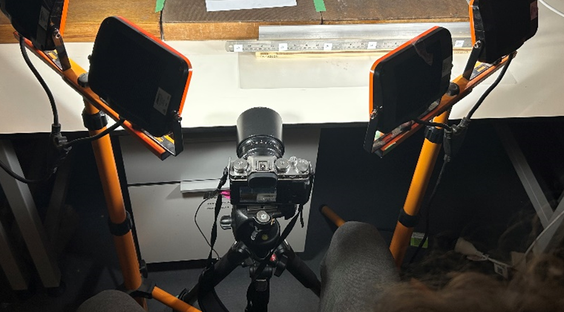

# Metashape Batch Processor (Markers, Orientation QC, Orthomosaics) for Kamen's jig.

A jig that Kamen Engel put together to help speed up core photography, with the intent of stitching photos to log tree core rings.
- Requires **Agisoft Metashape** (Professional), with Python API available.
- Designed for flat, linear samples (tree cores) photographed with printed coded targets for scale and orientation.

## stickOrthoPhotos.py

This script automates Agisoft Metashape processing for multiple folders of images. The script expects a root folder (variable root_folder) that contains folders of jpg images, one folder per tree core. The script will:
- Create a `.psx` per dataset folder
- Detects and assigns known control targets
- Aligns cameras (we align in batches- this is based on experience, this practice seems to yield better results)
- Validates camera rotations (yaw/pitch/roll), intending to keep the tree core in the x-y plane.
- Removes global pitch bias
- Builds an orthomosaic at a specified resolution
- Writes status sentinel files for traceability. A sentinel text file will be written per folder that describes the result (succes of reason of failure)

> **Intended use:** Datasets with printed targets labeled `target 1` ... `target 7` placed along an X-axis baseline with known spacing. No dense cloud step; model is built from tie points for orthomosaic generation as the surface is reasonably flat.

### Folder & File Conventions

For each immediate subfolder under `root_folder`:
- Images live directly inside the dataset folder (not nested).
- Metashape project will be created as `/<dataset>/<dataset>.psx`.
- A status text file is created/renamed to reflect processing state:
  - `{folder_name}_PROCESSING.txt`: processing has started on data in folder,
  - `{folder_name}_COMPLETE.txt`: processing is finished,
  - `{folder_name}_NOTENOUGHMARKERS.txt`: not enough markers were detected in the photos,
  - `{folder_name}_ROTATION_ERROR.txt`: the photos are not aliginig properly resulting in non-planar surface,
  - `{folder_name}_NO_IMAGES.txt`:no images in the folder.

---
## remove_pitch.py

A helper module that removes the average pitch from the chunk transform to keep the tree core flat in the XY plane.
Functions:

    get_average_pitch(chunk):
    Computes the mean pitch angle (in degrees) across all aligned cameras.
    remove_average_pitch(chunk):
    Applies an inverse rotation to the chunk transform to zero out the average pitch.

We added this step as even after alignment, small systematic pitch errors can cause the orthomosaic to tilt. This correction ensures the core is level before generating the orthomosaic, and keeps the scale true.

## create_Orthos.py

A helper module to create orthomosaics from all .psx files in a folder. Used when orthomosaics are needed for a large number of projects. The main function process_document() opens a .psx file, builds an orthomosaic with the specified resolution, saves the document and exports the orthomosaic as a .tif file.

## metashapeMenu.py

A helper module that add the various functions/module to the Metashape application, under a menu called 'Scripts'. Sometimes it's just easier to use the GUI  ¯\_(ツ)_/¯ 

